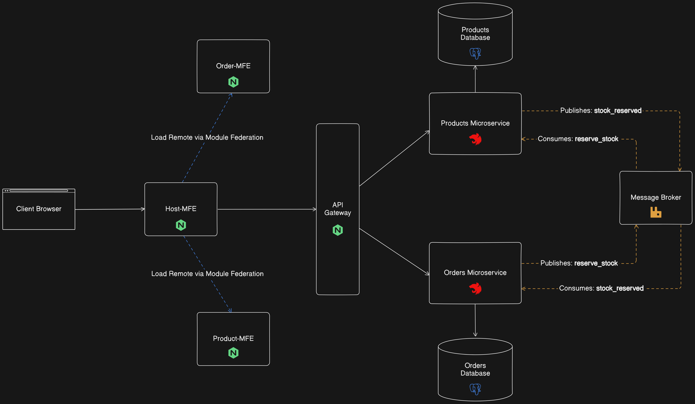

# Bachelor/Graduation Project

This monorepo contains the backend of my Bachelor project, which investigates how integrating SPA-based micro-frontends with microservices contributes to the scalability of web applications. For benchmarking purposes, the project compares the scalability of a monolithic SPA frontend with the microfrontends architecture. The development phase of the application has concluded, and quantitative and qualitative assessments are currently underway. The application details, including [system architecture](#system-architecture), [utilized technologies](#technologies), [benchmarking setup](), and [instructions on how to run the project](#instruction-for-running-the-back-end), are outlined in the following sections of this `README.md`.

## System Architecture



### Frontend

This project includes two frontend implementations: a __monolithic SPA__ and a __micro-frontend-based SPA__, both developed with React to ensure a fair comparison in scalability analysis.

- The monolithic frontend bundles all UI logic into a single build and is served through one Nginx web server. It does not rely on loading additional static assets from external frontend services.

- The micro-frontend architecture, depicted in the diagram above, splits the UI into independently built and deployed micro-frontends.

#### Micro-frontend Architecture

The micro-frontend setup consists of three separate React applications, each deployed to its own Nginx web server:

1. Host micro-frontend (`host-mfe`) - Serves as the entry point of the application. It loads the other micro-frontends dynamically at runtime.
2. Order micro-frontend (`order-mfe`) - Responsible for rendering the orders interface.
3. Product micro-frontend (`product-mfe`) - Responsible for rendering the products interface.

This architecture supports independent development, deployment, and technology agnosticism.

> __Independent Development & Deployment__: Each micro-frontend can be developed and deployed independently. Teams maintain their own codebases and can deploy updates to their respective frontend modules without affecting the rest of the system. For example, if the order team updates the UI for the order list and redeploys it to the order-mfe server, the host application will automatically load the new version, provided the updated module was correctly shared with the host-mfe. For further implementation details, refer to the [`host-mfe`](https://github.com/Haggag-dev/SeCBP.host-mfe) repository's README.md.
>
> __Technology Agnosticism__: While this project uses React for all frontend modules, the architecture powered by Module Federation, supports integration React and Vue. For instance, React and Vue can coexist by using bridging techniques, as outlined in the [Module Federation Bridge documentation](https://module-federation.io/practice/bridge/#why-bridge). However, Module Federation does not yet offer out-of-the-box support for seamless integration of a wide variety of frontend frameworks in a single runtime environment. As such, practical implementation beyond integrating React and Vue would require additional development effort and custom solutions.


### Backend

The backend consists of two microservices, __Products__ and __Orders__ microservices, and a message broker. Each microservice has its own database.

#### Orders Microservice

The Orders microservice exposes `REST API` endpoints:

1. `GET /users/:userId`: Retrieves a list of all orders associated with a specific user by their ID..
2. `GET /order/:orderId`: Retrieves a specific order by its ID.
3. `POST /orders/:order`: Creates a new order. The request body must include the following JSON payload:

    ```json
        {
            "user_id": number,
            "product_id": number,
            "product_name": string,
            "product_price": number
        }
    ```

When a user clicks the "Order Now" button, a request is sent to the Orders service via the `POST /orders/:order` endpoint. The Orders service then creates a new order with its initial status set to `processing`, responds to the client with a `202 Accepted` status if successful, and emits a `reserve_stock` event to check if there is sufficient stock for the requested product.

The Orders service is also subscribed to a `stock_reservation` event, which notifies whether the requested product has enough stock. After placing the order, the frontend can retrieve the latest order information using the `GET /users/:userId` endpoint.

#### Products Microservice

The Products microservice exposes the following `REST API` endpoints:


1. `GET /`: Retrieves a list of all products and their details.
2. `GET /:id`: Retrieve the details of a specific product using its ID.
3. `PUT /:id/stock`: Allows an admin to update the stock of a products using its ID.

The Products service is subscribed to the `reserve_stock` event. When it receives a stock reservation request, it processes the following payload:


    ```json
        {
            "order_id": number,
            "user_id": number,
            "product_id": number,
            "stock": number
        }
    ```

After verifying whether sufficient stock is available, the service emits a `stock_reserved` event to indicate whether the stock reservation was successful or rejected.

#### API Gateway

The API Gateway acts as the single entry point to the backend, forwarding client requests to the appropriate microservice. It exposes the APIs of all backend microservices, making them accessible as if they were served from a single server.

The gateway runs at `http://localhost:8080/` and handles routing as follows:
- Products Service-related endpoints are accessible under the `/products` path.
- Order Service-related endpoints are accessible directly under the root `/` path.

This abstraction simplifies communication between the frontend and the backend by hiding the internal service structure.

## Technologies

All web servers, backend services, the message broker, and the API gateway were containerized using Docker to ensure consistent environments across development and testing, simplify deployment, and enable reproducible service instances.

### Frontend

- __React__: All frontend implementations—both the micro-frontends and the monolithic SPA—were developed using React for consistency in scalability benchmarking.
- __Module Federation__: Used exclusively in the micro-frontend architecture to enable dynamic, runtime integration of independently deployed frontend modules.
- __Nginx__: Used as the web server to serve static files for each frontend application.

### Backend

- __NestJS__: Both microservices were developed using NestJS, a backend framework that offers a modular architecture and built-in support for features like dependency injection and integration with message brokers.
- __PostgreSQL__: Each microservice connects to its own PostgreSQL database. PostgreSQL was selected due to its reliability, ACID compliance, and robust support for relational data modeling.
- __RabbitMQ__:  Used as the message broker to facilitate asynchronous communication between services. RabbitMQ was chosen for its maturity, ease of integration with NestJS, and support for publish/subscribe messaging patterns.

### API Gateway

- __Nginx__: Acts as the API gateway, routing incoming requests to the appropriate microservice.

## Benchmarking Setup

__Currently under progess__. Benchmarking results will be documented once the evaluation is complete.

## Note

This system is a full-stack prototype designed primarily to assess the scalability of the frontend. Therefore, it intentionally omits certain production-grade features:
- __Authentication service__ – excluded as the focus is scalability, not security.
- __Complete e-commerce functionality__ - omitted due to time constraints related to the Bachelor project deadline.
- __Load balancing__ – not included due to local development constraints and backend deprioritization.
- __Caching mechanisms__ – omitted for the same reasons as above.
- __Advanced container orchestration__ – excluded to keep the environment lightweight and local.
- __Focus on UI functionality, not design__ – visual styling and UX polish were not priorities.
- __No CDNs for serving static files__ – static files are served locally using dedicated Nginx web servers for each frontend.

## Instruction for Running the Back-end

If you already have the backend up and running, you can explore either the [monolithic](https://github.com/Haggag-dev/SeCBP.monolithic-fe) or the [micro-frontends](https://github.com/Haggag-dev/SeCBP.host-mfe) implementation.

### Prerequisites
- Clone the backend repository: https://github.com/Haggag-dev/SeCBP.back-end
- [Install docker desktop](https://docs.docker.com/desktop/).
- (Optional) Install [TablePlus](https://tableplus.com/) to manually insert product and order data into the database for the frontend to render.

> ![Warning] Ensure Docker is running before proceeding with the next steps.

### Docker Images

Build the Docker image for the __Products__ microservice:

```sh
docker build -t products-microservice:1.4 . -f apps/products.microservice/Dockerfile
```

Build the Docker image for the __Orders__ microservice:

```sh
docker build -t orders-microservice:1.2 . -f apps/orders.microservice/Dockerfile
```

### Running the Project

Use the following command to start the backend services along with the API Gateway:

```sh
docker compose -p secbp up
```

### Inserting Dummy Data

Once the services are up, open TablePlus and connect to the Products database. Run the following SQL command to insert sample product data for the frontend to render:

```sql
INSERT INTO product (name, price) VALUES
('T-Shirt', 19.99),
('Jeans', 39.99),
('Sweater', 29.99),
('Jacket', 59.99),
('Dress', 49.99),
('Shoes', 69.99),
('Hat', 14.99),
('Scarf', 12.99),
('Socks', 5.99),
('Gloves', 9.99),

('Book 1', 10.99),
('Book 2', 13.99),
('Book 3', 11.99),
('Book 4', 12.99),
('Book 5', 9.99),
('Book 6', 15.99),
('Book 7', 18.99),
('Book 8', 16.99),
('Book 9', 13.49);
```

Next, connect to the Orders database and insert the following dummy order data:

```sql
INSERT INTO orders (user_id, product_id, product_name, product_price, status, created_at) VALUES
(1, 1, 'T-Shirt', 19.99, 'confirmed', '2025-04-14 10:15:00'),
(1, 5, 'Dress', 49.99, 'rejected', '2025-04-14 11:20:00'),
(2, 8, 'Scarf', 12.99, 'confirmed', '2025-04-14 12:05:00'),
(2, 10, 'Gloves', 9.99, 'confirmed', '2025-04-14 13:30:00'),
(3, 3, 'Sweater', 29.99, 'confirmed', '2025-04-14 14:00:00'),
(3, 7, 'Hat', 14.99, 'confirmed', '2025-04-14 15:10:00');
```

### Running the Frontend

To run the micro-frontends, please refer to the [`host-mfe`](https://github.com/Haggag-dev/SeCBP.host-mfe) repository.

If you'd like to run the monolithic frontend instead, refer to the [`monolithic-fe`](https://github.com/Haggag-dev/SeCBP.monolithic-fe) repository.